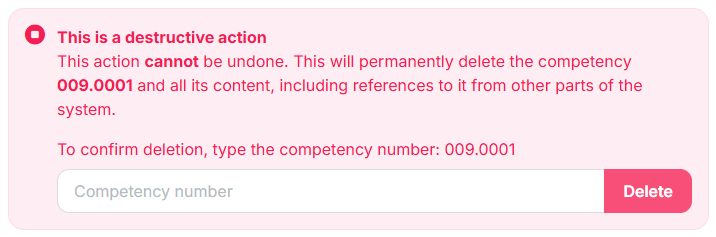

# Style guide

Conventions for a consistent, unified approach to layout and style throughout the user interface.

## Overview

The CMDS design system in the `cmds-app/platform` repository is the reference for the web app's look and layout: `design/README.md` sets the visual foundations, and `design/guidelines/page-patterns.md` sets the shape of each kind of page. It is extracted from the running code, and where the two disagree the code wins. This page covers the conventions that hold beyond it.

## Tabs

The sequence of the tabs on a form should follow this basic rule:

Primary/essential content, then secondary content, then advanced/optional content

Tabs should represent a logical information architecture, and should use progressive disclosure (don't overwhelm with too much detail on the first tab).

For example:

- Basic info (required, foundational)
- Advanced settings (optional, builds on basic)
- Permissions (contextual, depends on other settings)
- Review (summary, final step)

## Buttons

### Placement

Button placement depends on the specific context and type of action. **Bottom placement** is preferred for:

- **Form submission buttons** (Save, Submit, Continue) - users expect these at the bottom after completing the form
- **Wizard/stepper navigation** (Next, Previous, Finish)
- **Modal dialogs** - actions typically appear at the bottom
- **Mobile interfaces** - bottom placement is more thumb-friendly

**Top placement** is preferred for:

- **Page-level actions** (Create new, Add item, Export)
- **Toolbar actions** (Edit, Delete, Share) that apply to the entire page or selected content
- **Navigation actions** that don't require form completion
- **Destructive actions** that you want to separate from form submission buttons

### Alignment and sequence

Page and record actions sit on the right of the page header. A form's buttons sit at its foot in a consistent order, with the primary action last:

- **Primary action** (Save, Submit) - the solid button, last in the row.
- **Secondary actions** (Cancel, Back) - outline buttons, before it.
- **Destructive actions** (Delete, Revoke) - the destructive button, and always confirmed before they run. Where possible, keep them apart from the form's other buttons, for example in the page header or a section of their own.

## Confirmations

The prompt for confirmation of a destructive action should look like this:

## Tooltips

Tooltips provide brief, contextual help for UI elements. They should be concise, scannable, and easy to understand.

**Tone:**

- Use a clear, neutral, and instructional tone.
- Avoid jargon, unless it is widely understood by users.

**Length:**

- Aim for one sentence or less.
- Avoid multiple sentences or blocks of text.

**Punctuation:**

- **Do not use ending punctuation** (like periods) **for short phrases or fragments**.
  _Example: "Displays on the learner's dashboard"_
- **Use a period** if the tooltip is a complete sentence.
  _Example: "This text appears under the achievement title."_

**Grammar:**

- Use sentence case (capitalize the first word).
- Use active voice when possible.

**Icons:**

- Including an icon is optional.
- When you include an icon in a tooltip, follow a consistent semantic hierarchy:
    - Question mark for help/documentation
    - Info for basic information
    - Lightbulb for insights and quick tips

**Examples:**

- Bad: "this text will be shown under the achievement title."
- Good: "This text appears under the achievement title."
- Good: "Appears under the achievement title"

## Grids

Action icons in data tables and grids should be placed in the **right-most column**.

This follows the natural reading flow (left-to-right in most languages) where users first scan the data content and then encounter the actions they can take on that data. There are some exceptions:

- **Selection controls** (like checkboxes) are typically placed in the left-most column
- In some cases, a single primary action icon might be placed on the left if it is the most important element for that row

The right-aligned approach for action icons is part of Material Design's broader principle of creating a clear visual hierarchy and intuitive user flow in a data-dense interface element.
