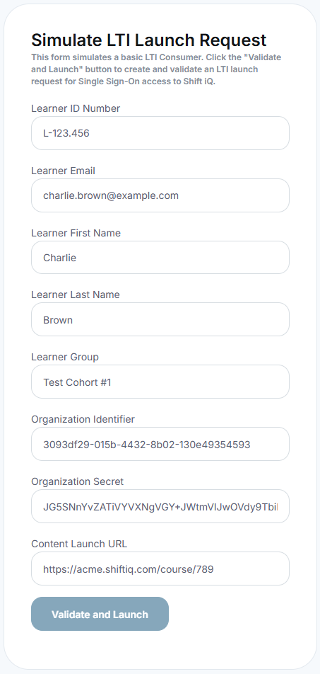

# Single Sign-On

Single Sign-On (SSO) is an authentication scheme that allows a user to log in with a single ID to any of several related, yet independent, software systems.

Refer to this Wikipedia article for background information about [Single Sign-On](https://en.wikipedia.org/wiki/Single_sign-on).

CMDS supports four industry-standard mechanisms for SSO:

1. Microsoft, through Microsoft Entra ID (formerly Azure Active Directory), which covers Microsoft 365 work and school accounts - the **Login with Microsoft** button on the sign-in page
2. Google - the **Login with Google** button on the sign-in page
3. Security Assertion Markup Language (SAML)
4. Learning Tools Interoperability (LTI)

We do not implement or support custom SSO mechanisms due to the potential security and privacy risks associated with them.

## Learning Tools Interoperability (LTI)

Here are some additional details for using LTI for SSO with the CMDS platform.

While LTI is not primarily designed as a SSO mechanism, some of the data it passes in a launch request is about the user. LTI works on the basis of a trust relationship between systems, which is established by means of a key and a secret. This makes it much simpler than providing access to a common identity server.

In LTI, a user is authenticated by a primary system and then can be passed to another system (internal or external) by way of a signed launch message. The system that receives this message verifies its authenticity by inspecting its digital signature, and then implicitly trusting the data it carries; thereby eliminating the need to authenticate the user a second time or reconfirm the user's identity.

This approach makes LTI a low-cost option for implementing SSO between systems.

Refer to this article for details: [LTI as a SSO Mechanism](https://www.imsglobal.org/learning-tools-interoperability-sso-mechanism)

An LTI launch message submitted for SSO access to CMDS looks something like this:

The LTI Launch message is signed with a secure digital signature, using [HMAC-SHA1](https://learn.microsoft.com/en-us/dotnet/api/system.security.cryptography.hmacsha1), with a secret key that is shared between the two systems. This is the OAuth 1.0a signature method that LTI 1.1 specifies. CMDS supports HMAC-SHA1 only; HMAC-SHA256 is not supported.

When CMDS receives this message from a user's web browser, it validates the signature on the message to confirm it is a legitimate interoperability request from an authorized external system.

If the request is valid, then CMDS authenticates the learner and navigates to the requested course in the CMDS Learning Portal.
