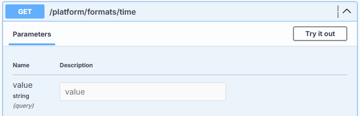

# Date and time values

> "Punctuality is not just limited to arriving at a place at the right time; it is also about taking actions at the right time." - Amit Kalantri

The API stores date/time values in Microsoft SQL Server using the [DATETIMEOFFSET](https://learn.microsoft.com/en-us/sql/t-sql/data-types/datetimeoffset-transact-sql?view=sql-server-ver16) data type, and in PostgreSQL using the [timestamp with time zone](https://www.postgresql.org/docs/17/datatype-datetime.html) data type.

## Why is explicit time zone information so important?

Consider the following date/time value for example:

**2025-11-02 01:30 AM**

The exact meaning of this value is ambiguous. In most of Canada and the United States, daylight saving time (DST) ended on November 2, 2025 at 2:00 AM. At that moment, clocks are set back one hour. Therefore, the hour from 1:00 AM to 2:00 AM occurs twice:

- First, under Eastern Daylight Time (EDT, UTC-4)
- Then again, under Eastern Standard Time (EST, UTC-5)

Furthermore, without a time zone or UTC offset specified, the value might also represent:

- November 2, 2025 at 5:30 AM Greenwich Mean Time in Europe/London
- November 1, 2025 at 11:30 PM Mountain Daylight Time in America/Edmonton (Calgary), where DST had not yet ended
- November 1, 2025 at 10:30 PM Mountain Standard Time in America/Phoenix (no DST)
- November 1, 2025 at 10:30 PM Pacific Daylight Time in America/Los_Angeles

In contrast, consider the following date/time offset value:

**2025-11-01T22:30:00-07:00**

In contrast to the previous example, the exact meaning of this value is **not** ambiguous. It identifies one moment only:

- November 2, 2025 at 5:30 AM UTC

It cannot be interpreted to mean any other moment. On that date, a local time seven hours behind UTC was Pacific Daylight Time in America/Vancouver and America/Los_Angeles, and Mountain Standard Time in America/Phoenix.

Note that an offset pins down the moment, not the time zone. Several time zones can share the same offset on a given date, so if you also need to know *where* a value was recorded, store the time zone identifier (such as `America/Edmonton`) alongside it.

!!! note "Alberta Time"
    Alberta has eliminated the practice of semi-annual clock changes and adopted [permanent Alberta Time](https://www.alberta.ca/albertas-new-time-system-abt), equivalent to UTC-6:00. Beginning in November 2026, clocks in Alberta no longer reset to Mountain Standard Time. The 2025 examples on this page follow the rules in effect at the time: Mountain Daylight Time (UTC-6) in summer and Mountain Standard Time (UTC-7) in winter. This is one more reason to store the offset with every value: a value recorded with its offset keeps its meaning when a jurisdiction changes its rules.

Explicitly including time zone awareness - i.e., embedding it in a single atomic value with the date and time - ensures every date/time value includes the calendar date, the time of day (based on a 24-hour clock), and the time zone offset (based on Coordinated Universal Time).

In turn, this guarantees the precise meaning of a value is never ambiguous with regard to time zone or (where applicable) rules about daylight saving time.

### Other benefits of using date/time offset values with time zone awareness

- Converting between time zones is predictable and accurate, enabling clear transformations and comparisons across systems with different time zones and/or daylight saving time rules.
- Representing specific moments in time globally can be done quickly and easily. Two different values with two different offsets can still be compared meaningfully and reliably by internally converting both to UTC.
- Logging, auditing, and monitoring in distributed systems where clients and servers operate in different time zones require unambiguous timestamps.
- Aligning with formal standards and industry best practices found in other modern APIs is especially important for data serialization. This is critical for reliable communication between systems that need to exchange time-based data across platform boundaries.

## ISO 8601

The API uses the [ISO 8601](https://en.wikipedia.org/wiki/ISO_8601) format for all date/time values.

This format is often referred to as the **round-trip format** in data serialization contexts because it guarantees a date/time value can be:

- **Serialized** (converted to a string), and then
- **Deserialized** (parsed back to the original object)

with **zero loss** of information.

### Key characteristics enabling round-trip accuracy

| Characteristic | Description |
| :--- | :--- |
| **Full date-time precision** | Includes year, month, day, hour, minute, second, fractional seconds (optional). |
| **Time zone offset** | Encodes the UTC offset (e.g., `-07:00`, `+00:00`, or `Z` for UTC), preserving global context. |
| **Unambiguous format** | Uses fixed patterns like `YYYY-MM-DDTHH:mm:ssK`, where `K` includes the offset. |
| **Invariant across cultures** | Not affected by locale settings (e.g., no "AM/PM", no localized month names). |

## The round-trip format

In .NET, the ISO 8601 format corresponds to the "O" (round-trip) or "o" format specifier for function calls to `DateTimeOffset.ToString()`.

.NET follows the ISO 8601 standard with this pattern:

`yyyy-MM-ddTHH:mm:ss.fffffffK`

where:

- `yyyy-MM-dd` is the date
- `T` is the literal separator between date and time
- `HH:mm:ss` is the time in 24-hour format
- `.fffffff` is the fractional seconds (if present)
- `K` is the offset from UTC

To recap, this format is culture-invariant and unambiguous, making it ideal for data exchange, serialization, and storage scenarios where it is necessary to preserve the exact calendar date, time of day, and time zone for a specific moment in time.

### Data examples

Here are a few examples that show ISO 8601 values and their corresponding local times:

| ISO 8601 Date/Time | Local Time |
| :--- | :--- |
| `2025-10-31T23:00:00-07:00` | October 31, 2025 11:00 PM PDT |
| `2025-07-01T12:00:00-07:00` | July 1, 2025 12:00 PM PDT |
| `2025-12-25T10:00:00-05:00` | December 25, 2025 10:00 AM EST |
| `2025-01-15T09:00:00-07:00` | January 15, 2025 9:00 AM MST |
| `2025-03-10T01:30:00-07:00` | March 10, 2025 1:30 AM PDT |
| `2025-09-15T16:15:00-07:00` | September 15, 2025 4:15 PM PDT |
| `2026-12-01T09:00:00-06:00` | December 1, 2026 9:00 AM Alberta Time |

### Code examples

In .NET, the `"o"` or `"O"` format specifier produces a string like this:

```csharp
DateTimeOffset original = DateTimeOffset.Parse("2025-11-01T22:30:00-07:00");
string serialized = original.ToString("o");  // "2025-11-01T22:30:00.0000000-07:00"
DateTimeOffset parsed = DateTimeOffset.Parse(serialized);
```

!!! success
    `parsed == original` - the round-trip is **lossless**

### Practice makes perfect

Check out this service in the API:



You can practise with your own input values to see exactly how they are parsed and interpreted by the server. For example:

#### Example input

`api/schemas/formats/time?value=2025-11-11T22:30:00-07:00`

#### Example output

```json
{
  "Original": "2025-11-11T22:30:00-07:00",
  "Formats": {
    "Value": "Tuesday - November 11, 2025 - 10:30:00 PM America/Edmonton",
    "RoundTrip": "2025-11-11T22:30:00.0000000-07:00",
    "Offset": "-07:00:00",
    "TimeZone": "America/Edmonton",
    "ISO8601": "2025-11-11T22:30:00.0000000-07:00",
    "RFC3339": "2025-11-11T22:30:00.000-07:00",
    "ShortDate": "2025-11-11",
    "LongDate": "November 11, 2025",
    "ShortTime": "10:30 PM",
    "LongTime": "10:30:00 PM",
    "FullDateTime": "November 11, 2025 10:30:00 PM",
    "SortableDateTime": "2025-11-11T22:30:00",
    "UniversalSortable": "2025-11-12 05:30:00Z",
    "UnixTimestamp": "1762925400",
    "UTC": "2025-11-12 05:30:00 UTC",
    "UTC_ISO8601": "2025-11-12T05:30:00.0000000Z",
    "Quarter": "4",
    "Week": "46",
    "Day": "315",
    "IsWeekend": "False"
  },
  "Conversions": {
    "Eastern": {
      "DateTime": "Nov 12, 2025 12:30:00 AM EST",
      "Offset": "-05:00"
    },
    "Mountain": {
      "DateTime": "Nov 11, 2025 10:30:00 PM MST",
      "Offset": "-07:00"
    },
    "Pacific": {
      "DateTime": "Nov 11, 2025 9:30:00 PM PST",
      "Offset": "-08:00"
    }
  }
}
```

The **TimeZone** value is the first supported time zone whose offset matches the input on that date, identified by its [IANA](https://www.iana.org/time-zones) name. `ShortDate`, `LongDate`, `ShortTime`, `LongTime`, and `FullDateTime` follow the server's culture settings, so they can differ from this sample.

The **Original** format is the format your code should use whenever it sends any date/time value to the API.
