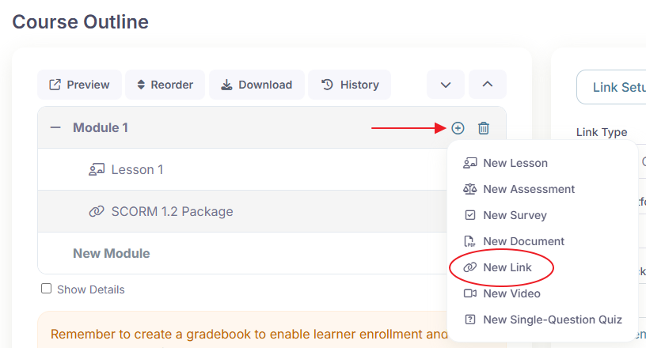
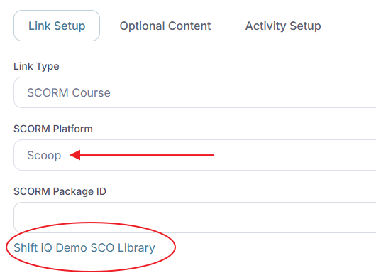
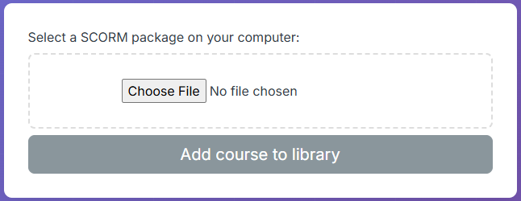
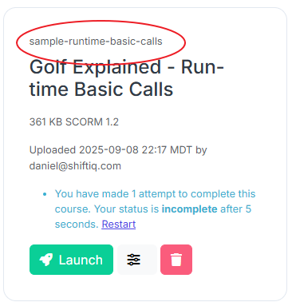
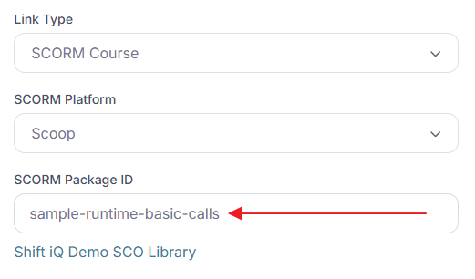
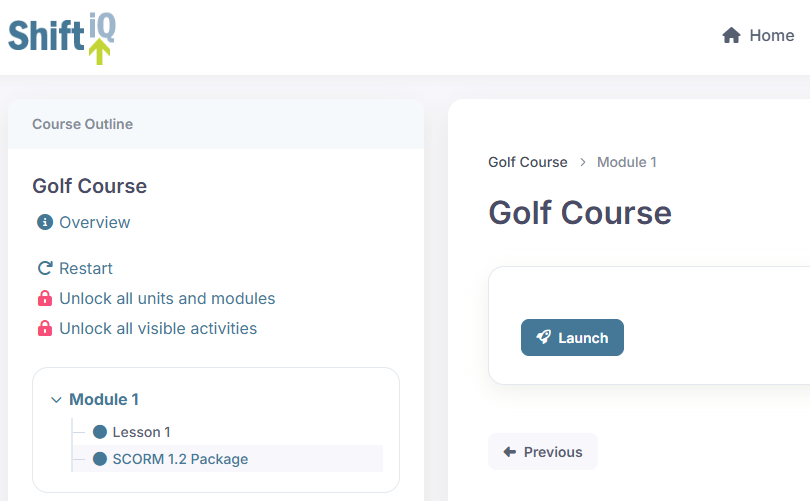
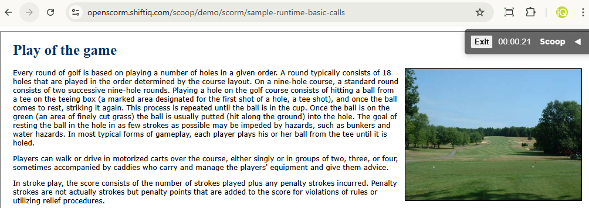

# Adding SCORM content to a course

Adding a SCORM package to a course activity in CMDS is a simple process.

Here are the step-by-step instructions.

## Step 1

Add a Link activity to a module in your course, and set its **Link Type** to **"SCORM Package"** (on an existing activity, the option is called **"SCORM Course"**).

## Step 2

Select "OpenSCORM (Scoop)" as your SCORM Platform. It is the only platform available.

If an SCO library is not already created for your organization, the system will create it automatically, and display a link to the library.

Click the link to open your SCO library.

## Step 3

Upload your SCORM package.

Click the button to choose a file on your computer, and click the button to add your SCORM package to your library.

The system will generate a SCORM package identifier for you automatically. It converts the name of your file to lowercase, and replaces non-alphanumeric characters with hyphens. This ensures the identifier is web-friendly. Copy this to your clipboard.

## Step 4

Paste the SCORM package identifier into the field labelled "SCORM Package ID".

## Step 5

Save your changes, preview the course in CMDS, and click the Launch button to confirm your content is displayed.

## Courses in more than one language

If you have the same course in several languages, upload one package per language and give them the same base identifier followed by a language code, for example `i-100-intro-en` and `i-100-intro-fr`.

On the activity, enter the base identifier (`i-100-intro`) as the SCORM Package ID and check **"Append a language code to SCORM Package ID"**. CMDS launches the package that matches each learner's language, and falls back to English when there is no package in their language.
